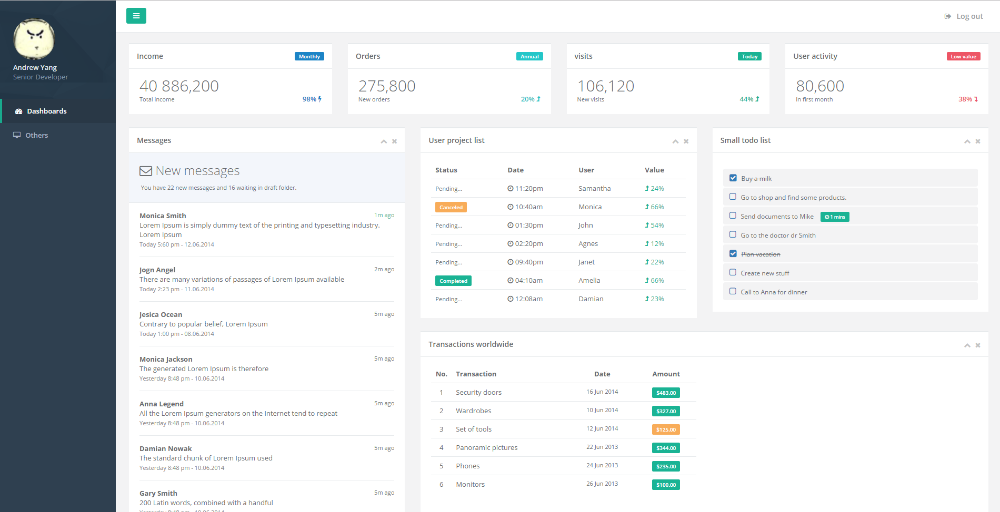

# Admin panel and UI Components for Angular.

Start your own Angular project with ng-dashboard in minutes!

## Demo

<a target="_blank" href="https://ddvkid.github.io/ng-dashboard"></a>

<a target="_blank" href="https://ddvkid.github.io/ng-dashboard">Live Demo</a>

## How to start

You will need to clone the source code of ng-dashboard GitHub repository.

`git clone https://github.com/ddvkid/ng-bootstrap.git`

After the repository is cloned, go inside of the repository directory and install dependencies:

```
cd ng-dashboard
npm install
npm start
```
